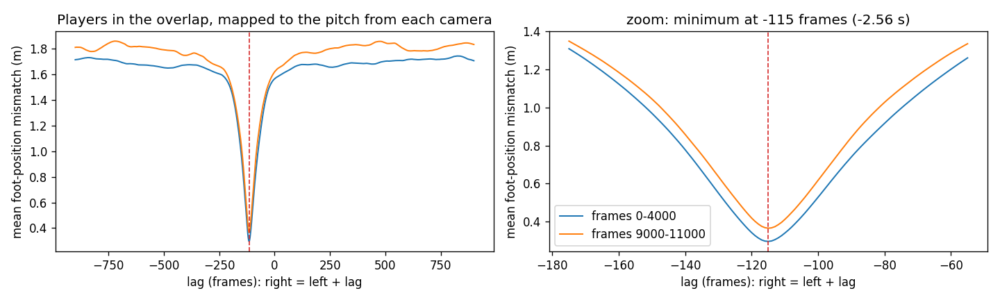
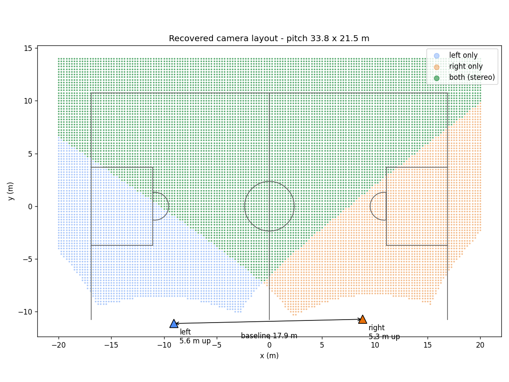
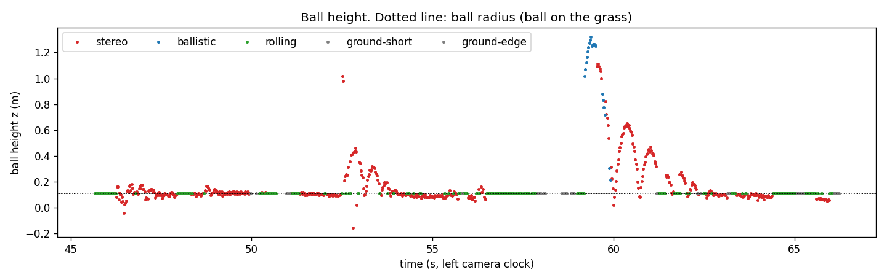

# 04 — Players and ball in metres, from the two fixed cameras

Code: `mapping3d/`. Tool: `tools/check_cameras_qt.py`. Requirement 3.

## Goal

Turn pixel positions from the two cameras into positions on the pitch in metres,
including the ball's height, with no calibration supplied.

Everything below was estimated from the footage alone. The single outside assumption is
the goal frame: 3 m × 2 m, the futsal / 5-a-side standard. That one fact sets the scale.

Coordinates are in metres with the origin at the centre spot. x runs along the pitch
towards the goal the right camera sees, y runs across it towards the far touchline, and z
points up with the grass at z = 0.

## What we tried

### Syncing the two videos

The cameras did not start recording together, so the same frame number shows different
moments in each video. Without syncing, every cross-camera comparison is wrong.

| Tried | Why it failed |
|---|---|
| Audio | The stereo files have no audio track. |
| Timestamps and metadata | No creation time. The clip lengths differ (13,677 vs 13,556 frames) only because of unreadable pre-roll frames with negative timestamps (175 and 54). The readable frame counts are equal, so the length difference says nothing about start times. |
| Correlating 1-D motion or brightness signals | Dominated by compression artefacts: keyframe spikes every 90 frames and a 3-frame B-frame rhythm. Different stretches gave different answers. |
| Matching image features in the overlap | The cameras are 18 m apart, so the same area looks too different; SIFT found nothing usable. |

### Calibrating from the pitch

Off-the-shelf pitch calibrators (TVCalib, PnLCalib) assume a standard 105 × 68 m field.
This pitch is small, caged and of unknown size, so they would return confident, wrong
distances. Instead, a parametric model of this pitch is fitted with its dimensions as
unknowns.

Seeds that failed: PnP without a distortion model (errors around 1700 px), and a joint
fit from a cold start, which converged to a 67 m wide pitch.

We also expected, before measuring, that the cameras stood side by side and shared only
a narrow overlap around the centre circle. The calibration showed the opposite.

## What worked

### Sync by geometry (`sync.py`)

Once both cameras are calibrated to the same pitch, a player's feet map to the same
(x, y) from either camera, but only when both frames show the same instant. So people
are detected on a stretch of each video, and for every candidate lag from −900 to +900
frames the players seen by both cameras are mapped to the pitch and their mismatch
measured. The lag with the smallest mismatch wins.



| Stretch | Lag (sub-frame) | Mismatch at the lag | Mismatch elsewhere |
|---|---|---|---|
| frames 0–4000 | −115.1 | 0.30 m | 1.68 m |
| frames 9000–11000 | −114.9 | 0.37 m | 1.79 m |

One sharp minimum, the same value 3.5 minutes apart, and no clock drift (0.06 frames per
minute). **Right frame = left frame − 115**: the right camera started 2.56 s later.

### Calibration (`background.py`, `plumb.py`, `calibrate.py`)

1. **Player-free background.** The median of 45 frames spread over the clip removes the
   players and keeps the painted lines, which a brightness top-hat filter then extracts.
2. **Lens distortion first, on its own.** The pitch lines are straight in reality and
   curved in the image. A division model is fitted so that they become straight again.
   This needs neither pitch size nor camera pose. Line bow drops from 21.6 to 6.7 px RMS
   on the left camera and from 21.2 to 4.4 px on the right.
3. **Pose, focal length and pitch size jointly.** One least-squares problem over both
   cameras and one shared pitch: per camera the focal length, rotation and position;
   shared, every pitch dimension; scale from the goal posts. It starts from about 13
   hand-read keypoints per camera, refines by ICP on about 3000 white-line pixels per
   camera, and ends with a full bundle adjustment in raw pixels with the lens freed too.
   That last step fixed a 50 px miss on the centre circle, which sits at the curved image
   edge exactly where the two views overlap.

Because both cameras are fitted against one pitch, their poses share one world frame.
That is the stereo calibration.

### Positions (`map3d.py`)

**Players.** Feet are on the grass, so one camera is enough: the ray through the bottom
of the box meets the ground plane. Where both cameras see a player, the two are matched
and averaged, and stereo also triangulates the top of the box, giving a player height
that nothing in the calibration knew about.

**Ball.** Where both cameras see it, its position is the closest point between the two
rays, with no assumption about height. Where only one camera sees it, a single ray does
not fix depth, so two physical models compete over each 0.4 s window: **rolling** (on
the grass, constant velocity) and **ballistic** (free flight under gravity). Gravity is
what makes height recoverable from one view. Ballistic wins only if it fits clearly
better, fits well in absolute terms, and stays physical.

## Results



| Quantity | Value | How it was checked |
|---|---|---|
| Time offset | −115 frames (2.56 s) | same value at two points 3.5 min apart |
| Calibration fit | 4.7 px left, 4.3 px right RMS | every marking fitted to 2–7 px |
| Pitch size | **33.8 × 21.5 m**, circle radius 2.35 m | width is the least certain dimension (±1 m) |
| Camera positions | left (−9.1, −11.1, 5.6 m up), right (8.9, −10.7, 5.3 m up) | both about 39° down |
| Stereo baseline | **17.9 m** | wide, well-conditioned stereo |
| Stereo coverage | the whole far half and the middle | only the near corners are single-camera |
| Same player, left vs right camera | 0.22 m median, 0.48 m p90 | independent cameras agree |
| Player height from stereo | 1.49 m median (1.36–1.65), n = 5277 | plausible, never used in calibration |
| Running speed | median 4.6, p99 17.5 km/h | a wrong scale would give absurd speeds |
| Ball by stereo | 529 of 926 frames (57 %) | the two rays pass 2.3 cm apart (median) |
| Stereo ball height | 0.11 m median | equal to the ball's radius: rolling on the grass |
| Single camera vs stereo | 62 % of real flights found, 59 % precision | 9 cm error on the ground, 65 cm in the air |



The stereo track records real flights and bounces: around 59–62 s the heights run
1.4 → 0.7 → 0.5 → 0.3 m, a ball bouncing with decaying height.

Everything covers the 926 frames (20.6 s) where both tracked segments overlap after
syncing.

## What broke, and limits

- **The first lens fit cheated.** It pushed the model's denominator through zero, which
  sends points to infinity where every line looks straight. Bounding the model so it
  stays valid to the image corners fixed it. A scale-free residual also let it stretch
  the image instead of straightening it, fixed by measuring error in original pixels.
- **The inverse lens diverged in the corners.** Drawing a 3D point into the image needs
  the inverse of the lens model. A dense round-trip test over the whole image showed
  that plain Newton's method diverged in the outer 5 % of the frame. It now brackets the
  root and bisects; the round-trip error is about 10⁻¹² px everywhere. Re-running after
  the fix moved the pitch width by 1 m and the baseline from 18.3 to 17.9 m. All numbers
  here are after the fix.
- **Flights were never detected at first.** The rolling model was allowed to accelerate,
  so a low hop fitted just as well as a roll with an unphysical acceleration along the
  viewing ray. Making rolling constant-velocity fixed it.
- **A false 4 m flight.** A window straddling a kick fitted both models badly, and
  ballistic was merely less bad. A flight must now also fit well in absolute terms.
- **Scale rests on one assumption.** If the goals are 3.66 × 1.22 m instead, every
  distance scales by about 1.2. Heights and speeds are consistent with 3 × 2 m, but that
  is plausibility, not proof.
- **No ground truth for positions.** Every check is a consistency check: two cameras
  agreeing, stereo against one camera, physical plausibility. ISSIA-3D, which holds
  ground-truth 3D ball positions from fixed cameras calibrated from field lines, would
  let the same pipeline report measured errors.
- **Low, short hops are hard from one camera.** 38 % of airborne frames are missed. Stereo
  covers most of the pitch, so this mainly affects the near corners.
- **89 of 926 frames have no ball in either camera.** Detection gaps pass straight through.
- **Ball size as a depth cue is too noisy to use.** 18 % median distance error at 20–40 px.

## Reproduce

Results go to `../outputs/mapping3d/` (override with `FMM_WORK`). Tracks are read from
`../outputs/tracking/final_{left,right}/tracks.json` (override with `FMM_TRACKS`).

```bash
python mapping3d/background.py                      # player-free backgrounds and line masks
python mapping3d/plumb.py                           # lens distortion from straight lines
python mapping3d/calibrate.py                       # joint two-camera calibration
python mapping3d/detect_players.py --frames 0 4000                  # people per frame, for sync
python mapping3d/detect_players.py --frames 9000 11000 --tag _late  # second stretch, for drift
python mapping3d/sync.py                            # time offset
python mapping3d/make_synced.py                     # synced copies of both videos
python mapping3d/map3d.py                           # players and ball in metres
python mapping3d/render.py                          # top-down video and figures
python tools/check_cameras_qt.py                    # point-picking and sync-checking app
```
